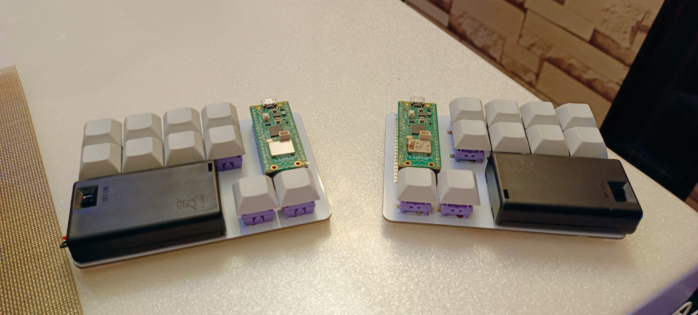
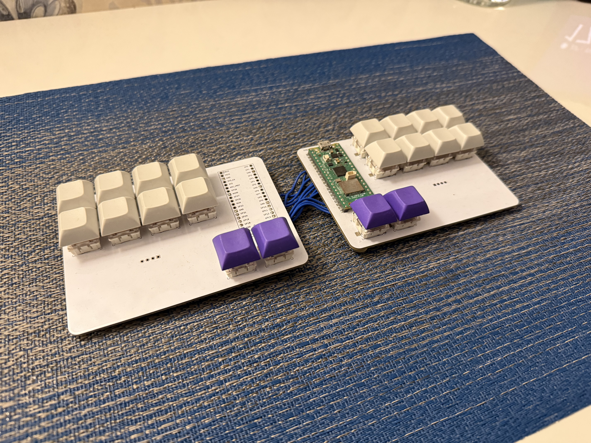
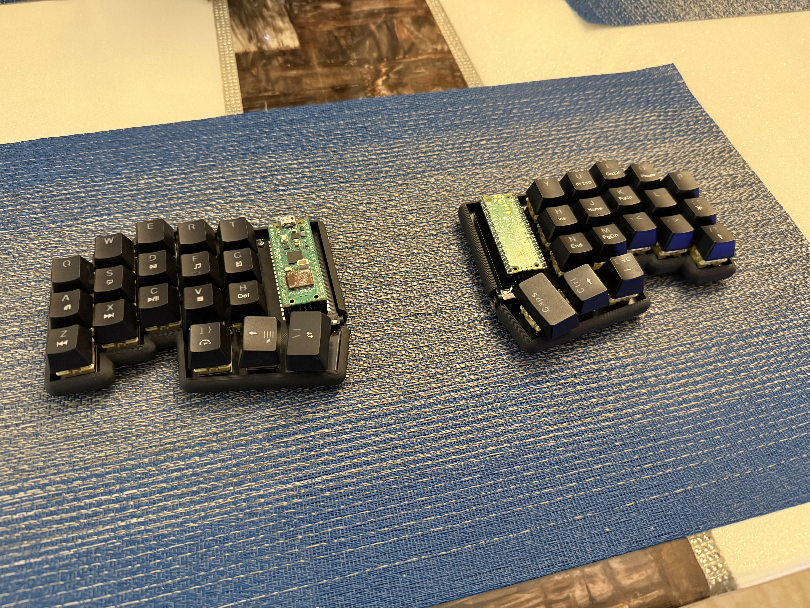
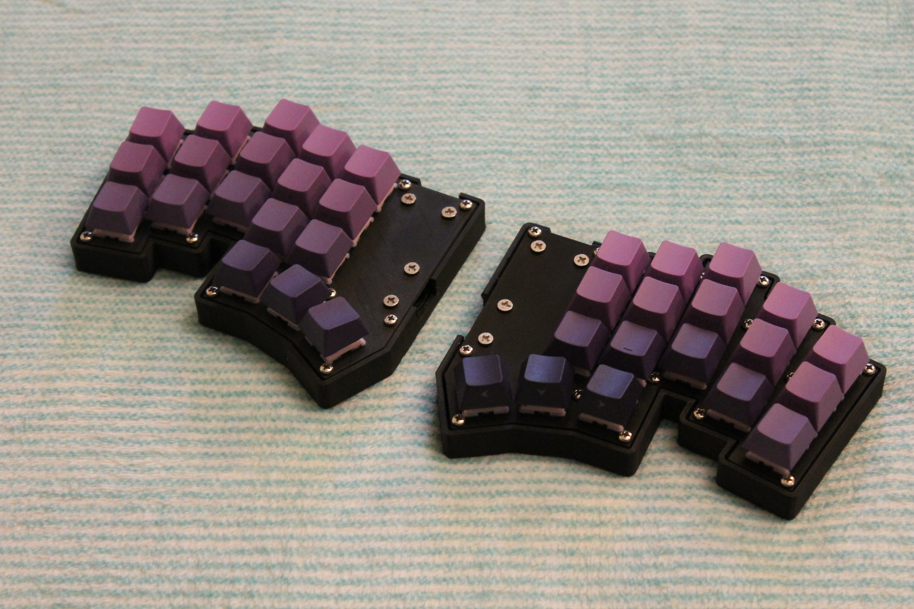
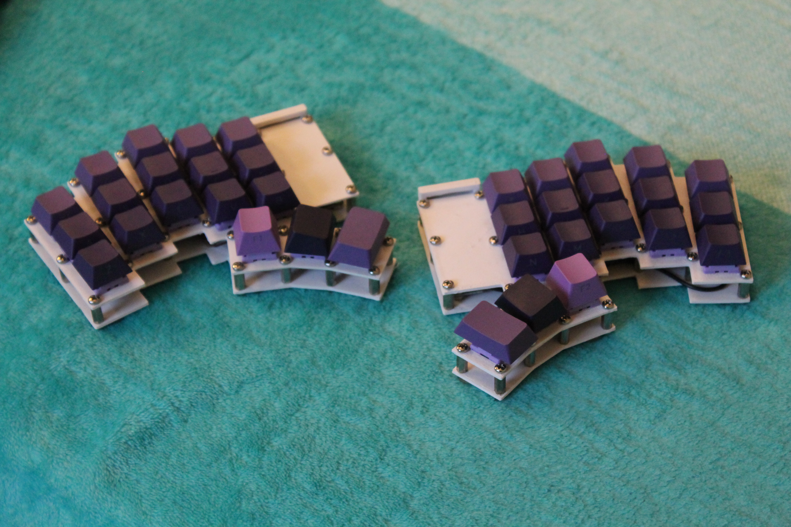

# Custom input devices

## First Iteration (20 keys)

- Fully Wired (with QMK) or semi-wireless (with custom firmware which is not mature enough)
- AA batteries. (no need to worry about battery degradation that we have with Li-Po batteries)
- MCU: Raspberry Pi Pico W

### Fully Wired Equivalent

### Problems

- 20 keys is too less to implement a practical keymap
- PCB does not have mounting holes for a proper case
- Standard AA batteries are heavy

## ESD Keyboard (36 keys)

- Fully Wired only with TRRS port for inter-connectivity
- Proper enclosure to avoid damage to the electronic components
- Hot-swappable MCU: Raspberry Pi Pico W
- Firmware: QMK
- Matured keymap capable of replacing the traditional keyboard fully
- [linkedin post](https://www.linkedin.com/posts/aditya23043_just-completed-my-most-ambitious-project-activity-7335380768921198593-B5wh?utm_source=share&utm_medium=member_desktop&rcm=ACoAAEb0rpkBcvkxpg6PQ2YDkrWiA3oRIAywLL4) (with demo)

### Problems

- For this specific build, I re-used the PCB for both halves due to which
  the TRRS connection to the MCU is reversed. To resolve this, I scratched
  away the copper pads on the PCB and manually connected the TRRS pins to
  the MCU pins
- The TRRS cable is not a common type of cable
- Exposed MCU
- Heat set inserts for mounting can be a bit unstable after frequent
  disassembly

## Silent Mechanical Keyboard (36 keys)

- Fully mature enclosure with several screw offsets for structural integrity
- Fully wired keyboard with inter-connection using USB Type-C cable
- MCU hidden inside the enclosure and can enter bootloader mode when pressed the case above the mcu.
- Silent mechanical switches
- MCU: Raspberry Pi Pico W
- Firmware: QMK

## Cheapino (36 keys)

- 
