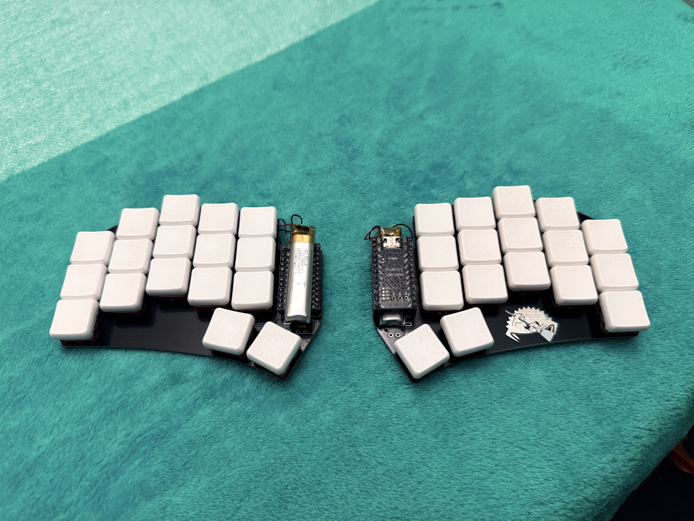

# Custom Ergonomic Input Devices

> Click on the keyboard image to go its github repository

## First Iteration (20 keys)

> [!NOTE]
> [Assembly Video](https://youtu.be/sDFPSLh6BhQ)

- Fully Wired (with QMK) or semi-wireless (with custom firmware which is not mature enough)
- AA batteries. (no need to worry about battery degradation that we have with Li-Po batteries)
- MCU: Raspberry Pi Pico W

### Problems

- 20 keys is too less to implement a practical keymap
- PCB does not have mounting holes for a proper case
- Standard AA batteries are heavy (in the semi-wireless one)

## ESD Keyboard (36 keys)

> [!NOTE]
> [Assembly Video](https://youtu.be/kpw8LIIt7Tc)

- Fully Wired only with TRRS port for inter-connectivity
- Proper enclosure to avoid damage to the electronic components
- Hot-swappable MCU: Raspberry Pi Pico W
- Firmware: QMK
- Matured keymap capable of replacing the traditional keyboard fully
- [linkedin post](https://www.linkedin.com/posts/aditya23043_just-completed-my-most-ambitious-project-activity-7335380768921198593-B5wh?utm_source=share&utm_medium=member_desktop&rcm=ACoAAEb0rpkBcvkxpg6PQ2YDkrWiA3oRIAywLL4) (with demo)
 
### Problems

- For this specific build, I re-used the PCB for both halves due to which
  the TRRS connection to the MCU is reversed. To resolve this, I scratched
  away the copper pads on the PCB and manually connected the TRRS pins to
  the MCU pins
- The TRRS cable is not a common type of cable
- Exposed MCU
- Heat set inserts for mounting can be a bit unstable after frequent
  disassembly

## Silent Mechanical Keyboard (36 keys)

- Handwired design without a PCB
- Fully mature enclosure with several screw offsets for structural integrity
- Fully wired keyboard with inter-connection using USB Type-C cable
- Experimented the column splay for the pinky and ring finger for enhanced
  ergonomics
- MCU hidden inside the enclosure and can enter bootloader mode when pressed the case above the mcu.
- Silent mechanical switches
- MCU: Raspberry Pi Pico W
- Firmware: QMK

## Cheap Keeb (28 keys)

- Intended to be an ultra compact and a cheap keyboard
- MCU: Waveshare RP2040 Zero
- Interconnect cable: USB Type-C
- First keyboard design of mine to test with the "open sides", sandwich plate type design

### Problems

- The MCU and type-C breakout board mounts were not considered beforehand
- Had to add additional 3d printed plate for handling those mounts after-the-fact
- At this point I was comfortable with only a layout about the 34 keys mapping, so it felt a little bit off due to the 6 less keys

## Cheapino (36 keys)

- Working successor of the cheap keeb (28 keys)
- Designed to be a cheap handwired keyboard with just a top and a bottom
  plate for enclosure held together with metal standoffs with the wiring in-between
- It **had** to be a fully wired build due to the budget constraint for this build
- Similar to previous keyboard but with the much smaller Waveshare Rp2040 Zero MCU
- Dedicated robust mount for the MCU
- Firmware: QMK
- More aggressive thumb cluster angle along with the pinky and ring finger
  column splay (angle)
- Inter-connectivity between the halves with USB type-c cable

## Wireless Ferris Sweep (34 keys)

- Fully wireless keyboard running ZMK connected with a dongle
- The most compact keyboard among the bunch because it is using the smaller
  dimensional kailh choc v1 switches with lesser spacing in between and
  lesser key travel
- Rechargable Lithium-Polymer batteries utilized
- NOTE: I have not made the PCB; it has been taken from https://github.com/davidphilipbarr/Sweep
